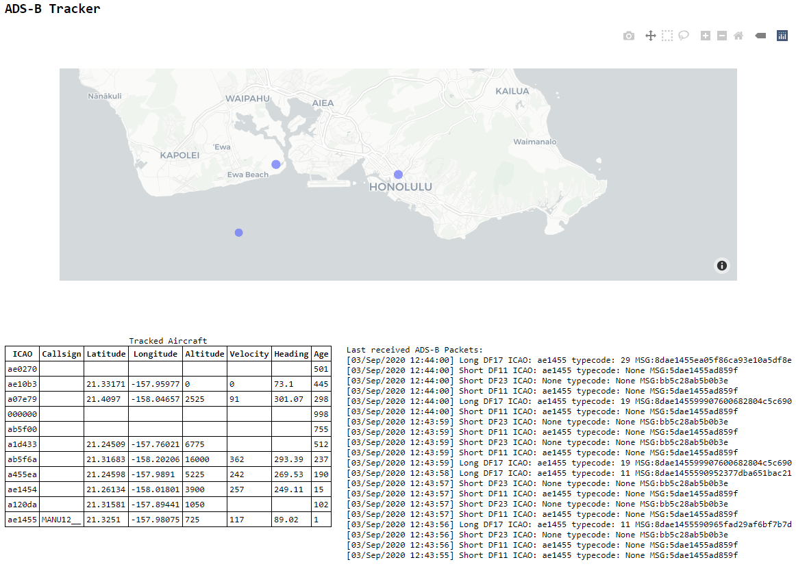

# ADS-B Tracker
 Simple program to decode ADS-B signals from an RTLSDR and track aircraft.
 
The foundational code comes from UC Berkeley's EE123 Lab 2, namely the main three functions that reads data from the RTLSDR (`main`, `signal_process`, and `sdr_read`) and the clever way to perform Manchester decoding (` bits = chunk[16::2] > signal[17::2] `). But the code to detect ADS-B preambles, decode the signal, and the classes to process packets and objects are mine.

