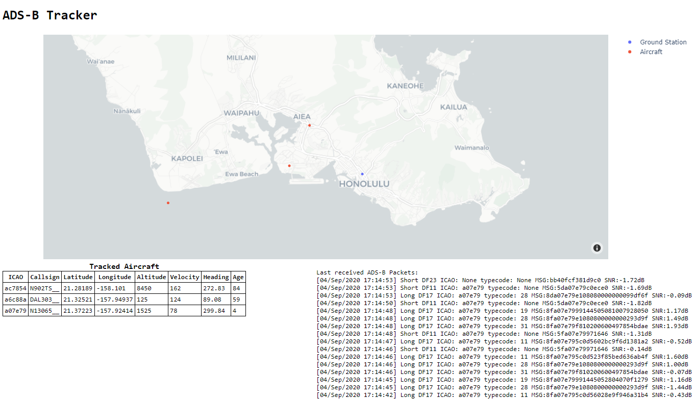

# ADS-B Tracker
Program to decode ADS-B signals from an RTLSDR and track aircraft on a map. Makes use of a Dash webserver to display the dashboard.
 
The foundational code comes from UC Berkeley's EE123 Lab 2, namely the main three functions that read data from the RTLSDR (`main`, `signal_process`, and `sdr_read`) and the clever way to perform Manchester decoding (` bits = chunk[16::2] > signal[17::2] `). But the code to detect ADS-B preambles, decode the RF signal, display the web dashboard, and the classes to process packets are mine. (Obviously excluding imported functionality such as Plotly and Dash)

```text
usage: main.py [-h] [--rtl_device device_index] [--location Lat Lon] [--TTL TTL] [--port PORT] [--log LOG]
               [--fix-single-bit-errors [Y/N]]

Listen for ADS-B signals using an RTL-SDR and watch the air traffic on local Dash webserver! Default location is
http://localhost:8050

optional arguments:
  -h, --help            show this help message and exit
  --rtl_device device_index, -d device_index
                        Select the RTL-SDR device index to use. Defaults to device 0.
  --location Lat Lon, -l Lat Lon
                        Set the latitude and longitude of your ground station; usually your current location. If
                        unset, attempts to determine your location using your IP address.
  --TTL TTL, -t TTL     Delete a tracked object if we haven't heard from it for TTL seconds. Default to 100 seconds.
  --port PORT, -p PORT  The local port to run the Dash webserver on. Default to port 8050.
  --log LOG             Where to log information on detected ADS-B packets. Does not log if unset.
  --fix-single-bit-errors [Y/N]
                        Have the decoder attempt to fix single bit errors in packets. VERY RESOURCE INTENSIVE AT THIS
                        TIME!!!
```


